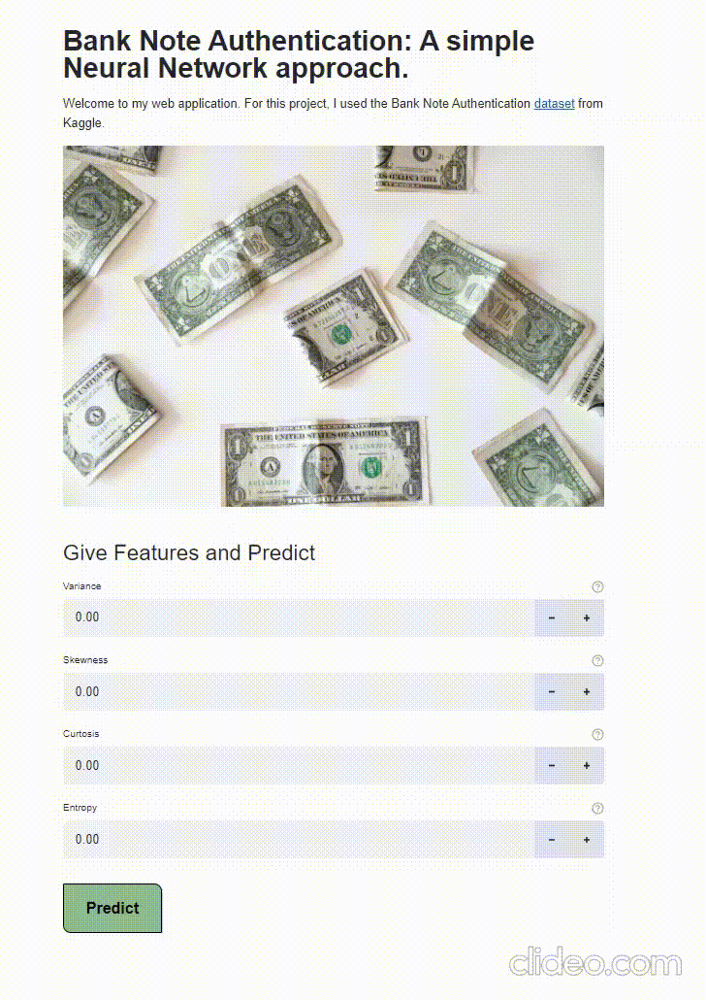

# Bank-Note-Authentication :heavy_check_mark:

Detection of fraudulent bank notes based on image-exctracted features. :dollar: :pound: :euro:

      

## Dataset
**Data from Kaggle**: https://www.kaggle.com/ritesaluja/bank-note-authentication-uci-data

Data were extracted from images that were taken from genuine and forged banknote-like specimens. For digitization, an industrial camera usually used for print inspection was used. The final images have 400x 400 pixels. Due to the object lens and distance to the investigated object gray-scale pictures with a resolution of about 660 dpi were gained. Wavelet Transform tool were used to extract features from images.

## Streamlit Web App

To run the application:
```
streamlit run Streamlit_app.py
```


